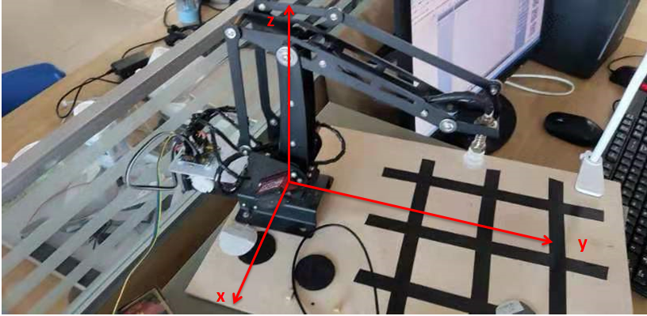
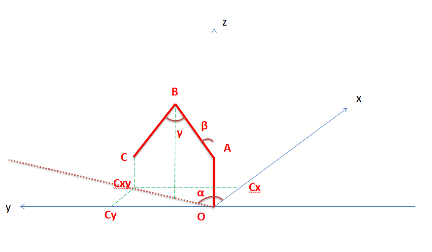

# 机械臂运动项目

## 工程项目简介

本工程使用维特智能公司的16路舵机驱动板驱动三轴机械臂运动（使用三路pwm对三个舵机进行控制），串口发送命令参考文件"说明书.pdf"编写,详见serial库,机械臂逆向运动学解算详见Arm库。

## 串口简介

串口部分使用的是Linux通信协议，详见代码。

## 机械臂简介



这个机械臂可以抽象为以下的模型图：



机械臂三个角度的坐标的相关数学推导式如下所示：

tan(α) = Cx/Cy

cos(γ) = (AB^2+BC^2-AC^2)/(2*AB*BC)

OCxy = BC*sin(γ-β)+AB*sin(β)

OA = Az

AC^2 = Cx^2+Cy^2+(Cz-Az)^2

联立上面五个方程，可以解出α，β，γ的值。

## 运行环境

Ubuntu 18.04, 参数文件使用了OpenCV里FileStorage类，所以应先配置好OpenCV4.2.0

运行脚本：

```
mkdir build && cd build
cmake ..
make
./robot
```